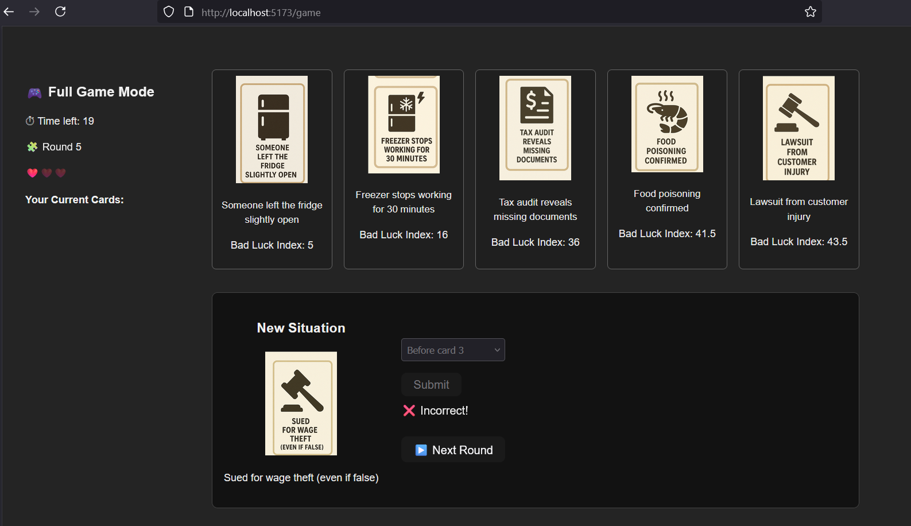
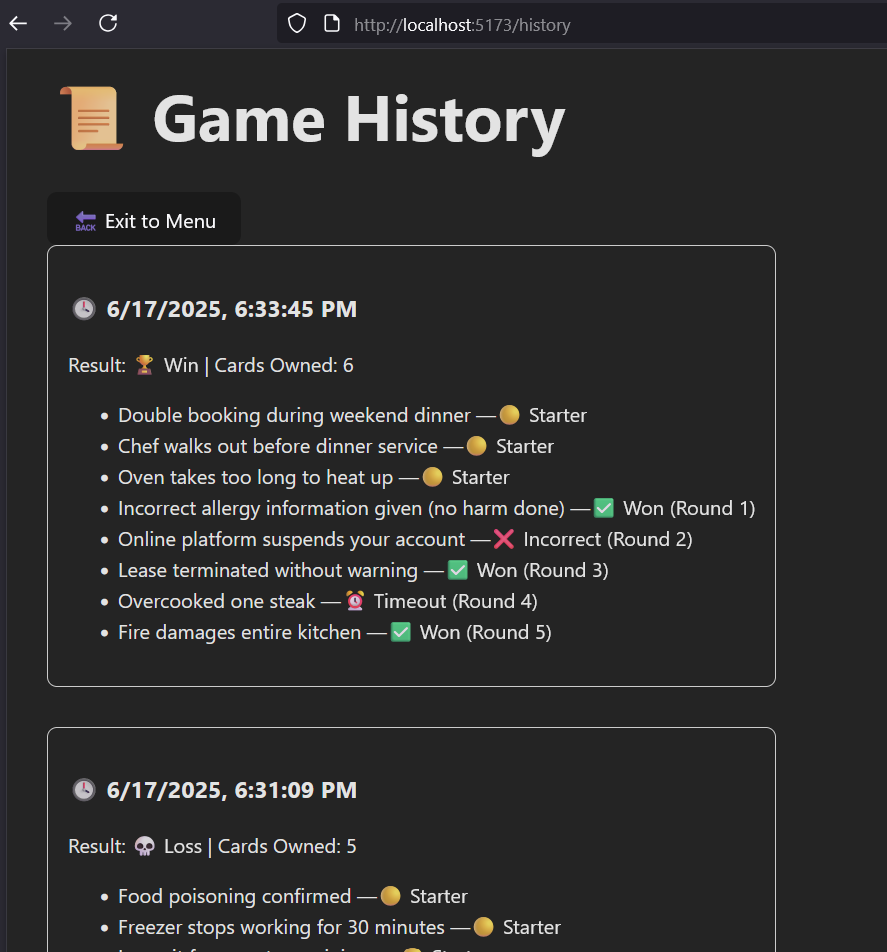

# Exam #1: "Stuff Happens"  
## Student: s339366 Faridreza Momtaz Zandi

---

## React Client Application Routes

- Route `/`: Start page. Lets users try a demo or log in to play the full game or look at game history.
- Route `/demo`: One-round demo game for guests using three random cards.
- Route `/game`: Full game for registered users. Tracks rounds, guesses, lives, and summary.
- Route `/history`: Displays completed games and all card outcomes per round.

---

## API Server

- `POST /api/login`  
  - Body: `{ username, password }`  
  - Logs in a registered user and starts session.

- `GET /api/logout`  
  - Clears the session and logs out the user.

- `GET /api/session`  
  - Returns `{ user }` if logged in, 401 otherwise.

- `GET /api/cards/demo`  
  - Returns 3 cards and 1 guess card for the demo game. No authentication required.

- `POST /api/cards/check-guess`  
  - Body: `{ guessIndex, startIndices, guessCardId }`  
  - Returns whether the guess was correct.

- `POST /api/games`  
  - Creates a new full game for the logged-in user and selects 3 starter cards.

- `GET /api/games/current`  
  - Fetches the current active game, collected cards, and lives remaining.

- `POST /api/games/:id/next`  
  - Gets the next guess card (not used in previous rounds) for the given game ID.

- `POST /api/games/:id/rounds`  
  - Body: `{ cardId, guessIndex, startIndices }`  
  - Saves the outcome of a round. Updates game status if won/lost.

- `GET /api/games/:id/summary`  
  - Returns the final outcome and all collected cards of the finished game.

- `GET /api/history`  
  - Returns all past games and the status of each round for the authenticated user.

---

## Database Tables

- Table `users`: Stores registered users with fields `id`, `username`, `email`, hashed `password`, name.
- Table `cards`: Stores all 100 cards with `id`, `name`, `image`, and `bad_luck_index`.  
- Table `games`: Tracks each game session with `id`, `user_id`, `start_time`, `end_time`, and `outcome`.
- Table `rounds`: Stores each round of a game with `id `, `game_id`, `round_number`, `card_id`, `won`, and `guessed_position`.

---

## Main React Components

- `Home` (in `Home.jsx`): Entry page with login, logout, and navigation to Demo or Full Game and history for the loged in user.
- `DemoGame` (in `DemoGame.jsx`): Handles demo logic with cards, timer, and result feedback.
- `FullGame` (in `FullGame.jsx`): Manages full game logic, round flow, UI layout, lives, timer, and end summary.
- `GameHistory` (in `GameHistory.jsx`): Displays previous games with round-by-round outcomes.
- `LoginForm` (in `LoginForm.jsx`): Form for username/password authentication.
- `AuthContext` (in `AuthContext.jsx`): Global user state and session management.

---

## Screenshots

### 🎮 Game in Progress

### 📜 User History

---

## Users Credentials

- username:`faridmmz`, password: `1234`
- username:`sinashariati`, password: `123457`

